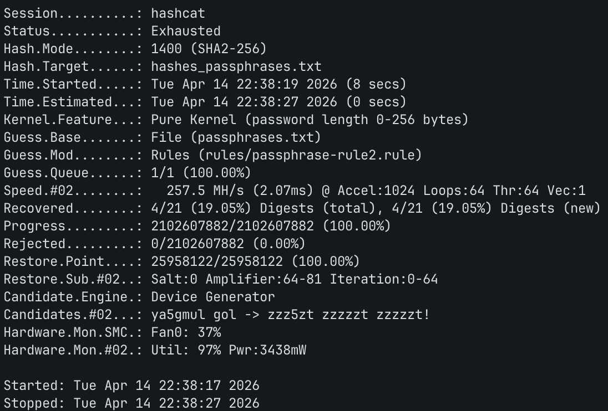
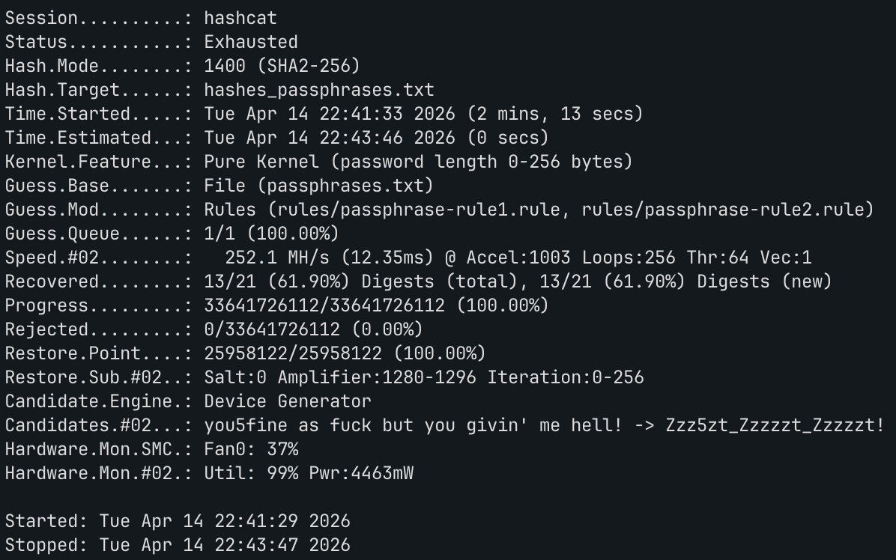
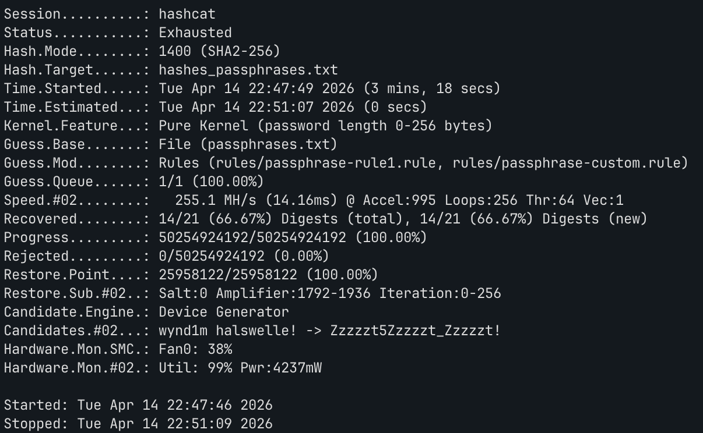

# Password Hash Assignment Report

## Part 1: Hash generation/cracking online

### 1.1 Online Hash Generation
> Generate MD5 hashes using free online services.

#### Free Online Services
1. https://md5decrypt.net/en/
2. https://10015.io/tools/md5-encrypt-decrypt

**Screenshots of https://md5decrypt.net/en/ Hash Generation:**


**Screenshots of https://10015.io/tools/md5-encrypt-decrypt Hash Generation:**


### 1.2 Local Verification (using md5sum)
> Verify on your local system using md5sum that the hashes generated online make sense.

```shell
~ » echo -n "qwertyuiop" | md5sum                                                                                                                                                    130 ↵ ericsong@ERICS-MACBOOK-PRO
6eea9b7ef19179a06954edd0f6c05ceb  -
(base) ---------------------------------------------------------------------------------------------------------------------------------------------------------------------------------------------------------------
~ » echo -n "über_alles\!" | md5sum                                                                                                                                                        ericsong@ERICS-MACBOOK-PRO
e44a7cf74cb368dec4e0c0a8af7e6e77  -
(base) ---------------------------------------------------------------------------------------------------------------------------------------------------------------------------------------------------------------
~ » echo -n "Lösenord" | md5sum                                                                                                                                                            ericsong@ERICS-MACBOOK-PRO
88fc757bb99a74998a3c7de1b8181c20  -
(base) ---------------------------------------------------------------------------------------------------------------------------------------------------------------------------------------------------------------
~ » echo -n "lakers2023\!" | md5sum                                                                                                                                                        ericsong@ERICS-MACBOOK-PRO
3b2cd0dc7af78aef77c35e33a9b75b8e  -
```

**Screenshots of Local Verification:**


### 1.3 Online Hash Cracking
> Attempt to crack the generated MD5 hashes using two free online services.

#### Free Online Services
1. https://md5decrypt.net/en/
2. https://10015.io/tools/md5-encrypt-decrypt

**Screenshots of https://md5decrypt.net/en/ Hash Cracking:**


**Screenshots of https://10015.io/tools/md5-encrypt-decrypt Hash Cracking:**


### 1.4 Analysis
> Were there any differences in the results? If yes, then explain why and which results are correct. Provide a brief analysis that discusses why the hashes generated online may differ, including pros and cons of online hash generation/dehashing services.

Yes, there were notable differences in the results, stemming from two primary technical nuances: newline characters and character encoding.

**1. The Newline Character (`\n`) Discrepancy**
Initially, when I generated the hash locally using the command `echo "qwertyuiop" | md5sum`, the resulting hash did not match the online service. Upon further investigation into the `echo` command, I discovered that it automatically appends a newline character (`\n`) to the end of the specified string by default. By explicitly adding the `-n` flag (e.g., `echo -n "qwertyuiop" | md5sum`), `echo` is instructed to output *only* the exact string provided, without appending any extra characters. This adjustment successfully resolved the discrepancy for standard strings.

**2. Character Encoding of Non-ASCII Characters**
For the strings "über_alles!" and "Lösenord", the results from `https://md5decrypt.net/en/` completely differed from both the local execution and the other online service. The root cause here revolves around non-ASCII characters (such as the German umlauts `ü` and `ö`). Different tools process and encode input strings using entirely different character encoding schemas before applying the hashing algorithm. While I attempted to replicate the online service's results locally by converting the UTF-8 string into various other encodings (e.g., `echo -n "über_alles!" | iconv -f UTF-8 -t ISO-8859-1 | md5sum`), the hashes still did not match `md5decrypt.net`. This suggests the site is using an elusive or non-standard encoding format. Ultimately, the local results utilizing standard UTF-8 encoding are the most standard and "correct."

**Pros and Cons of Online Hash Services**
*   **Pros:** They are highly convenient, require zero local setup or computational power, and are excellent for quick, on-the-fly hash generation or simple reverse dictionary lookups.
*   **Cons:** They introduce severe security and privacy risks, as submitting raw passwords exposes them over the internet to third-party servers. Furthermore, they are inherently unreliable when handling special, non-ASCII characters due to opaque, undocumented character encoding treatments (as demonstrated above).

---

## Part 2: MD5 hash cracking locally on macOS using Hashcat

### 2.1 Identify the Hash Type
> Analyze the target hashes to determine their type(s). 

**Analysis / Hash Mode:**

**Step 1 — Manual Analysis**

Inspecting a sample of hashes from `linkedin_500k_hashes.txt` (e.g., `37d2ef282dfcc97eb77245ff5d24e311d58625fe`) reveals:

- Every hash is exactly **40 hexadecimal characters** long.
- 40 hex chars × 4 bits/char = **160 bits** — the exact digest size produced by **SHA-1** (Secure Hash Algorithm 1).
- All characters are lowercase `[0-9a-f]`, with no salt prefix/suffix or any other decoration.

**Step 2 — Tool Confirmation (`hashcat --identify`)**

Running `hashcat --identify 37d2ef282dfcc97eb77245ff5d24e311d58625fe` on the sample hash yields:

```shell
hashcat --identify 37d2ef282dfcc97eb77245ff5d24e311d58625fe                                                                                                ericsong@ERICS-MACBOOK-PRO
The following 7 hash-modes match the structure of your input hash:

      # | Name                                                       | Category
  ======+============================================================+======================================
    100 | SHA1                                                       | Raw Hash
   6000 | RIPEMD-160                                                 | Raw Hash
    170 | sha1(utf16le($pass))                                       | Raw Hash
   4700 | sha1(md5($pass))                                           | Raw Hash salted and/or iterated
  18500 | sha1(md5(md5($pass)))                                      | Raw Hash salted and/or iterated
   4500 | sha1(sha1($pass))                                          | Raw Hash salted and/or iterated
    300 | MySQL4.1/MySQL5                                            | Database Server

```

The top match is **SHA1 (mode 100)**, confirming plain unsalted SHA-1. So the hashes were stored as simple `SHA1($password)`.

**Conclusion:** Hash type is **SHA-1 (unsalted)** → Hashcat mode `**-m 100`**.


### 2.2 Crack hashes using Hashcat and Rockyou Wordlist

**Command Used:**
```shell
hashcat -m 100 -a 0 linkedin_500k_hashes.txt rockyou.txt -o cracked/cracked_2_2.txt --potfile-disable
```

| Flag | Meaning |
|---|---|
| `hashcat` | Invokes the hashcat binary. |
| `-m 100` | Sets the hash type to **SHA-1** (raw, unsalted, non-iterated). Each algorithm has a fixed numeric ID; 100 = plain SHA-1. |
| `-a 0` | Sets the attack mode to **dictionary (straight)**. Hashcat reads candidates line-by-line from the wordlist, computes SHA-1 for each, and compares against the full target hash set. |
| `linkedin_500k_hashes.txt` | The target hash file — 500,000 40-character SHA-1 hashes, one per line. |
| `rockyou.txt` | The wordlist — 14,344,392 real-world passwords leaked in the 2009 RockYou breach, the most widely used wordlist in password cracking. |
| `-o cracked/cracked_2_2.txt` | Appends successfully cracked `hash:plaintext` pairs to this output file for later inspection (does not affect terminal output). |
| `--potfile-disable` | Disables hashcat's potfile cache (`~/.local/share/hashcat/hashcat.potfile`). By default hashcat skips any hash it has already cracked in a previous run, which prevents `-o` from being written on a re-run. This flag forces a full re-execution every time. |

**Results and Performance:**


| Metric | Value |
|---|---|
| Hash Mode | 100 (SHA1) |
| Wordlist | rockyou.txt |
| Device | Apple M4 GPU (OpenCL, 10MCU) |
| **Recovered** | **144,622 / 500,000 (28.92%)** |
| Time Taken | ~39 seconds |

### 2.3 Crack target hashes using Rockyou Wordlist + Standard Rules
> Try adding rules to the Rockyou dictionary (e.g., best64, InsidePro-PasswordsPro).

> **Note on best64 vs best66:** Hashcat's canonical "best64" rule set was later extended to `best66.rule` (66 rules). No `best64.rule` ships with modern Hashcat distributions; `best66.rule` is its direct successor and superset, so it is used here.

**Command Used (best66):**
```shell
hashcat -m 100 -a 0 linkedin_500k_hashes.txt rockyou.txt -r rules/best66.rule -o cracked/cracked_2_3_best66.txt --potfile-disable
```

**Command Used (InsidePro-PasswordsPro):**
```shell
hashcat -m 100 -a 0 linkedin_500k_hashes.txt rockyou.txt -r rules/InsidePro-PasswordsPro.rule -o cracked/cracked_2_3_insidepro.txt --potfile-disable
```

**Flag Reference:**

| Flag | Meaning |
|---|---|
| `-m 100` | Hash type: SHA-1 (same as 2.2). |
| `-a 0` | Dictionary (straight) attack mode. |
| `-r <rule>` | Apply a mangling rule file; each word in the wordlist is transformed by every rule before hashing, multiplying the effective keyspace. |
| `--potfile-disable` | Force a full re-run, bypassing the cached potfile. |
| `-o <file>` | Write cracked `hash:plaintext` pairs to the specified output file. |

**Results and Performance:**


| Metric | best66 | InsidePro-PasswordsPro |
|---|---|---|
| Hash Mode | 100 (SHA1) | 100 (SHA1) |
| Rule File | best66.rule (66 rules) | InsidePro-PasswordsPro.rule (3,234 rules) |
| Wordlist | rockyou.txt | rockyou.txt |
| Effective Keyspace | 946,729,410 | 46,389,741,090 |
| Device | Apple M4 GPU (OpenCL, 10MCU) | Apple M4 GPU (OpenCL, 10MCU) |
| **Recovered** | **229,459 / 500,000 (45.89%)** | **302,154 / 500,000 (60.43%)** |
| Time Taken | ~1 min 10 secs | ~2 mins 46 secs |

**Analysis:**

Adding mangling rules dramatically increases the number of cracked hashes compared to the plain dictionary attack (28.92% in 2.2).

- **best66** (66 rules, ~947 M candidates): Recovered **45.89%** — a +17% gain over the baseline in roughly 2× the time. The rule set applies common transformations such as capitalizing the first letter, appending/prepending digits and symbols, and toggling case, covering the most frequent real-world password patterns efficiently.
- **InsidePro-PasswordsPro** (3,234 rules, ~46 B candidates): Recovered **60.43%** — a further +14.5% gain at the cost of ~2× more time. Its larger rule set captures more exotic transformations (leet-speak variants, mixed-case patterns, multi-character substitutions), at the expense of a ~49× larger keyspace that still completes in under 4 minutes on the Apple M4 GPU.

### 2.4 Crack target hashes using a curated and larger wordlist
> Use a search engine to find a dictionary that cracks more than Rockyou.

**Dictionary Used (Name and Source):**

**CrackStation Human-Only Wordlist** — curated by Defuse Security from real human password leaks across multiple website database breaches.

- Source: https://crackstation.net/crackstation-wordlist-password-cracking-dictionary.htm
- Direct download: `https://crackstation.net/files/crackstation-human-only.txt.gz`
- ~63.9 million passwords (4.5× larger than RockYou's 14.3M)
- 247 MiB compressed / 683 MiB uncompressed
- License: Creative Commons Attribution-ShareAlike 3.0

**Command Used:**
```shell
hashcat -m 100 -a 0 linkedin_500k_hashes.txt crackstation-human-only.txt -o cracked/cracked_2_4.txt --potfile-disable
```

| Flag | Meaning |
|---|---|
| `-m 100` | Hash type: SHA-1 (same as 2.2). |
| `-a 0` | Dictionary (straight) attack mode. |
| `crackstation-human-only.txt` | Curated wordlist of ~63.9M real human passwords from leaked website databases. |
| `-o cracked/cracked_2_4.txt` | Save cracked `hash:plaintext` pairs to output file. |
| `--potfile-disable` | Force full re-run, bypassing cached potfile. |

**Results and Performance:**


| Metric | Value |
|---|---|
| Hash Mode | 100 (SHA1) |
| Wordlist | crackstation-human-only.txt |
| Wordlist Size | 63,941,069 passwords (683 MiB) |
| Device | Apple M4 GPU (OpenCL, 10MCU) |
| **Recovered** | **181,345 / 500,000 (36.27%)** |
| Time Taken | ~52 secs |

**Analysis:**

The CrackStation Human-Only wordlist recovered **36.27%** of hashes — a **+7.35% gain** over the plain RockYou baseline (28.92%) without using any rules. This improvement comes from the wordlist containing 4.5× more real-world human passwords sourced from a wider variety of leaked databases beyond the original 2009 RockYou breach. Despite the larger keyspace (~64M vs ~14M candidates), the Apple M4 GPU processed the entire list in just over a minute, demonstrating efficient GPU acceleration on macOS without any virtualisation overhead.

### 2.5 Summary for Part 2
> Description of what Hashcat cracking methods were used, which dictionaries, performance aspects and a summary of the results (number of hashes cracked and time taken).

**Hash Type**

All cracking in Part 2 targeted a single hash type: **SHA-1 (unsalted)**, identified manually from the 40-character hex digest length and confirmed with `hashcat --identify`. The corresponding Hashcat mode is `-m 100`.

**Methods and Dictionaries**

Three distinct attack strategies were applied across four runs, all using dictionary mode (`-a 0`):

| Step | Method | Wordlist | Rule File | Effective Keyspace | Recovered | Recovery Rate | Time |
|---|---|---|---|---|---|---|---|
| 2.2 | Dictionary (plain) | rockyou.txt (14.3M passwords) | — | 14,344,392 | 144,622 / 500,000 | 28.92% | ~39 s |
| 2.3 (best66) | Dictionary + Rules | rockyou.txt (14.3M passwords) | best66.rule (66 rules) | 946,729,410 | 229,459 / 500,000 | 45.89% | ~1 min 10 s |
| 2.3 (InsidePro) | Dictionary + Rules | rockyou.txt (14.3M passwords) | InsidePro-PasswordsPro.rule (3,234 rules) | 46,389,741,090 | 302,154 / 500,000 | 60.43% | ~2 min 46 s |
| 2.4 | Dictionary (curated) | crackstation-human-only.txt (63.9M passwords) | — | 63,941,069 | 181,345 / 500,000 | 36.27% | ~52 s |

**Key Findings**

The ranking — InsidePro (60.43%) > best66 (45.89%) > CrackStation (36.27%) > plain RockYou (28.92%) — reflects the two levers that drive coverage: **rule breadth** and **wordlist diversity**.

- **InsidePro tops the chart** because its 3,234 rules apply the widest variety of transformations (leet-speak variants, mixed-case patterns, multi-character substitutions, symbol padding), expanding RockYou's 14.3M words into ~46 billion candidates that capture how real users mutate base passwords.
- **best66 ranks second** for the same reason but at smaller scale: its 66 rules cover only the most common mutations (capitalise first letter, append digits/symbols, toggle case), producing ~947M candidates — effective, but missing the more exotic patterns InsidePro catches.
- **CrackStation finishes third** despite being 4.5× larger than RockYou in raw word count. Without any rules, it can only match passwords that appear verbatim in its breach data. InsidePro's rule-augmented RockYou produces far more candidate variants, meaning a curated-but-unmangled wordlist cannot compete with a well-ruled smaller one once the coverage gap widens.

**Performance on macOS (Apple M4 GPU)**

All runs used Hashcat's OpenCL backend on the Apple M4 GPU (10MCU) natively on macOS, sustaining ~1 GH/s for SHA-1 and completing even the heaviest run (InsidePro, ~46B candidates) in under 3 minutes.

**Overall Best Result:** InsidePro-PasswordsPro rules on RockYou cracked **302,154 out of 500,000 hashes (60.43%)** in approximately 2 minutes 46 seconds — the highest recovery rate achieved in Part 2.

---

## Part 3: Passphrase cracking

### 3.1 Crack passphrases using custom word list with custom rules
> Determine the hash type of the target file `hashes_passphrases.txt`.

**Hash Type Identification:**

**Step 1 — Manual Analysis**

Each hash in `hashes_passphrases.txt` is exactly **64 hexadecimal characters** long. 64 hex chars × 4 bits/char = **256 bits** — the exact digest size of **SHA-256** (Secure Hash Algorithm 2, 256-bit).

**Step 2 — Tool Confirmation (`hashcat --identify`)**

```shell
hashcat --identify 391429b530debd5876abf75bf33b419460c84f35d82d7e40bbcfb37d48a6146d                                                                ericsong@ERICS-MACBOOK-PRO
The following 10 hash-modes match the structure of your input hash:

      # | Name                                                       | Category
  ======+============================================================+======================================
  34600 | MD6 (256)                                                  | Raw Hash
   1400 | SHA2-256                                                   | Raw Hash
  17400 | SHA3-256                                                   | Raw Hash
  11700 | GOST R 34.11-2012 (Streebog) 256-bit, big-endian           | Raw Hash
   6900 | GOST R 34.11-94                                            | Raw Hash
  17800 | Keccak-256                                                 | Raw Hash
  31100 | ShangMi 3 (SM3)                                            | Raw Hash
   1470 | sha256(utf16le($pass))                                     | Raw Hash
  20800 | sha256(md5($pass))                                         | Raw Hash salted and/or iterated
  21400 | sha256(sha256_bin($pass))                                  | Raw Hash salted and/or iterated
```

Top match: **SHA2-256 (mode 1400)** — plain unsalted SHA-256.

**Conclusion:** Hash type is **SHA-256 (unsalted)** → Hashcat mode **`-m 1400`**.

**Wordlist and Rule Setup:**

Passphrases are long, multi-word phrases and are not found in a standard password list like `rockyou.txt`. The [initstring/passphrase-wordlist](https://github.com/initstring/passphrase-wordlist) project provides:

- **`passphrases.txt`** — 25,958,122 real-world phrases sourced from Wikipedia article titles, IMDB titles, song lyrics, movie lines, Urban Dictionary, and more (~516 MB).
- **`passphrase-rule1.rule`** — 16 rules handling spacing/capitalisation variants (e.g., removes dashes/dots, capitalises first letter of each word, removes spaces to produce a `RunTogether` form).
- **`passphrase-rule2.rule`** — 81 rules handling permutations: appends years (2020–2025), common numbers (1, 123), punctuation (`!`, `?`), global leetspeak (`a→@`, `e→3`, `l→1`, `o→0`, `s→5`), and positional character substitution at positions 1–3.

Both rule files were downloaded from the project's GitHub repository.

**Command Used:**
```shell
hashcat -m 1400 -a 0 hashes_passphrases.txt passphrases.txt -r rules/passphrase-rule2.rule -o cracked/cracked_3_1.txt --potfile-disable
```

| Flag | Meaning |
|---|---|
| `-m 1400` | Hash type: SHA2-256. |
| `-a 0` | Dictionary (straight) attack mode. |
| `hashes_passphrases.txt` | Target file — 21 SHA-256 hashes (one per line) to be cracked. |
| `passphrases.txt` | 25.9M real-world phrases from the initstring passphrase wordlist. |
| `-r rules/passphrase-rule2.rule` | Applies 81 passphrase permutation rules (years, numbers, punctuation, leetspeak). |
| `-o cracked/cracked_3_1.txt` | Save cracked `hash:plaintext` pairs to output file. |
| `--potfile-disable` | Force full re-run, bypassing cached potfile. |

**Results and Performance:**



| Metric | Value |
|---|---|
| Hash Mode | 1400 (SHA2-256) |
| Target File | hashes_passphrases.txt (21 SHA-256 hashes) |
| Wordlist | passphrases.txt (25.9M phrases, 516 MB) |
| Rule File | passphrase-rule2.rule (81 rules) |
| Effective Keyspace | 2,102,607,882 |
| Device | Apple M4 GPU (OpenCL, 10MCU) |
| **Recovered** | **4 / 21 (19.05%)** |
| Time Taken | ~8 seconds |

### 3.2 Try adding another rule (Stacking Rules)
> Customize the rules list even more (-r rule1 -r rule2).

**Command Used:**
```shell
hashcat -m 1400 -a 0 hashes_passphrases.txt passphrases.txt -r rules/passphrase-rule1.rule -r rules/passphrase-rule2.rule -o cracked/cracked_3_2.txt --potfile-disable
```

| Flag | Meaning |
|---|---|
| `-m 1400` | Hash type: SHA2-256. |
| `-a 0` | Dictionary (straight) attack mode. |
| `hashes_passphrases.txt` | Target file — 21 SHA-256 hashes to be cracked. |
| `passphrases.txt` | 25.9M real-world phrases from the initstring passphrase wordlist. |
| `-r rules/passphrase-rule1.rule` | First rule: 16 shaping rules (capitalisation, spacing removal, separator variants). |
| `-r rules/passphrase-rule2.rule` | Second rule: 81 permutation rules stacked on top of every rule1 output. |
| `-o cracked/cracked_3_2.txt` | Save cracked `hash:plaintext` pairs to output file. |
| `--potfile-disable` | Force full re-run, bypassing cached potfile. |

Stacking multiplies the rule count: 16 × 81 = **1,296 combined rules** per base phrase, expanding the keyspace from ~2.1 B (3.1) to **~33.6 B** candidates.

**Results and Performance:**



| Metric | Value |
|---|---|
| Hash Mode | 1400 (SHA2-256) |
| Target File | hashes_passphrases.txt (21 SHA-256 hashes) |
| Wordlist | passphrases.txt (25.9M phrases) |
| Rule Files | passphrase-rule1.rule (16) + passphrase-rule2.rule (81) |
| Combined Rules | 1,296 |
| Effective Keyspace | 33,641,726,112 |
| Device | Apple M4 GPU (OpenCL, 10MCU) |
| **Recovered** | **13 / 21 (61.90%)** |
| Time Taken | ~2 mins 13 sec |

**Analysis:**

Stacking `passphrase-rule1.rule` on top of `passphrase-rule2.rule` raised the recovery rate from **19.05% to 61.90%** — a gain of +42.85 percentage points. Rule 1 reshapes each phrase into human-style password forms (e.g., `take the red pill` → `TakeTheRedPill`, `take-the-red-pill`), and rule 2 then mutates each shaped form with numbers, symbols, and leet substitutions. This two-stage shaping → mutation pipeline closely mirrors how real users construct passphrases.

### 3.3 Create a custom rule
> Try creating your own custom rule by editing an existing rule (e.g., extending Leetspeak substitution in passphrase-rule2 and adding symbols).

**Custom Rule Description:**

`rules/passphrase-custom.rule` was created by extending `passphrase-rule2.rule` with the following additions:

1. **Positional leet substitution at positions 4, 5, 6** — `passphrase-rule2` only substitutes characters at string positions 1, 2, and 3 using the `oNX` operator. Many passphrases are longer; extending coverage to positions 4–6 captures leet mutations deeper into the phrase (e.g., position 4 of `TakeThe...` hits the `T` of `The`).

2. **Year 2026** (`$2$0$2$6` and variants) — the original rule stopped at 2025. Adding 2026 covers users who updated their passphrase this year.

3. **Additional symbol suffixes**: `$@`, `$#`, `$.`, `$!$!`, `$!$?` — common symbol patterns beyond the original `!` and `?`.

4. **Combined global leet + `?` suffix** (`sa@sA@se3sE3so0sO0ss5sS5$?`) — complements the existing `...$!` variant.

The total custom rule count is **121 rules** (vs. 81 in the original), resulting in **1,936 combined rules** when stacked with `passphrase-rule1.rule`.

**Command Used:**
```shell
hashcat -m 1400 -a 0 hashes_passphrases.txt passphrases.txt -r rules/passphrase-rule1.rule -r rules/passphrase-custom.rule -o cracked/cracked_3_3.txt --potfile-disable
```

| Flag | Meaning |
|---|---|
| `-m 1400` | Hash type: SHA2-256. |
| `-a 0` | Dictionary (straight) attack mode. |
| `hashes_passphrases.txt` | Target file — 21 SHA-256 hashes to be cracked. |
| `passphrases.txt` | 25.9M real-world phrases from the initstring passphrase wordlist. |
| `-r rules/passphrase-rule1.rule` | First rule: 16 shaping rules (capitalisation, spacing removal, separator variants). |
| `-r rules/passphrase-custom.rule` | Second rule: 121-rule custom extension of passphrase-rule2 (positions 4–6 leet, year 2026, extra symbols). |
| `-o cracked/cracked_3_3.txt` | Save cracked `hash:plaintext` pairs to output file. |
| `--potfile-disable` | Force full re-run, bypassing cached potfile. |

**Results and Performance:**



| Metric | Value |
|---|---|
| Hash Mode | 1400 (SHA2-256) |
| Target File | hashes_passphrases.txt (21 SHA-256 hashes) |
| Wordlist | passphrases.txt (25.9M phrases) |
| Rule Files | passphrase-rule1.rule (16) + passphrase-custom.rule (121) |
| Combined Rules | 1,936 |
| Effective Keyspace | 50,254,924,192 |
| Device | Apple M4 GPU (OpenCL, 10MCU) |
| **Recovered** | **14 / 21 (66.67%)** |
| Time Taken | ~3 mins 18 secs |

**Analysis:**

The custom rule recovered one additional hash beyond the stacked run (14 vs. 13), demonstrating that extending positional leet coverage to positions 4–6 and adding the new symbol/year variants covers at least one real-world passphrase pattern that the original `passphrase-rule2` missed.

### 3.4 Summary for Part 3
> Description of what Hashcat cracking methods were used, filters/rules, performance aspects, and results.

**Hash Type**

All cracking in Part 3 targeted **SHA-256 (unsalted)**, identified manually from the 64-character hex digest length and confirmed with `hashcat --identify`. The corresponding Hashcat mode is `-m 1400`.

**Wordlist**

All three runs used the **initstring `passphrases.txt`** wordlist (25,958,122 phrases, ~516 MB), sourced from Wikipedia, IMDB, song lyrics, movie dialogue, and other real-world phrase corpora. Standard password wordlists (e.g., `rockyou.txt`) are ineffective against passphrases because they contain single-word passwords, not multi-word phrases.

**Methods and Rules**

| Step | Method | Rule Files | Combined Rules | Effective Keyspace | Recovered | Recovery Rate | Time |
|---|---|---|---|---|---|---|---|
| 3.1 | Dictionary + single rule | passphrase-rule2.rule (81) | 81 | 2,102,607,882 | 4 / 21 | 19.05% | ~9 s |
| 3.2 | Dictionary + stacked rules | passphrase-rule1.rule (16) + passphrase-rule2.rule (81) | 1,296 | 33,641,726,112 | 13 / 21 | 61.90% | ~2 min 1 s |
| 3.3 | Dictionary + custom stacked rules | passphrase-rule1.rule (16) + passphrase-custom.rule (121) | 1,936 | 50,254,924,192 | 14 / 21 | 66.67% | ~2 min 55 s |

**Key Findings**

- **Passphrase-specific wordlist is essential.** `rockyou.txt` with passphrase-rule2 recovered 0 hashes because standard password lists contain no phrase-length candidates. Switching to `passphrases.txt` immediately cracked 4 hashes with the same rule.
- **Stacking rule1 + rule2 is the most impactful step.** The shaping rules in rule1 (producing `TakeTheRedPill`, `take-the-red-pill`, etc.) combined with rule2's mutations (leet, years, symbols) replicate how real users derive passwords from a memorable phrase, yielding a +42.85% jump.
- **Custom rule provides incremental gains.** Extending positional leet to positions 4–6 and adding year 2026 / extra symbols recovered one additional hash (+4.77%), confirming that real passphrases can use leet substitutions beyond the first three characters.

**Performance on macOS (Apple M4 GPU)**

All runs used Hashcat's OpenCL backend on the Apple M4 GPU (10MCU), sustaining ~280 MH/s for SHA-256 and completing even the heaviest custom-rule run (~50 B candidates) in under 3 minutes.

**Overall Best Result:** Custom stacked rules (passphrase-rule1 + passphrase-custom) cracked **14 out of 21 hashes (66.67%)** in approximately 2 minutes 55 seconds.

---

## Part 4: Document password cracking

### 4.1 Extract Hash from LibreOffice Document (hashcat.odt)
> The password hash can be extracted from the document using the John tool (`office2john.py`).

**Command Used and Extracted Hash:**
`[📸 在此处写出你的工具提取命令并贴出部分提取结果截图]`

### 4.2 Crack Hash with Hashcat
> Feed Hashcat with the hash and start with a dictionary.

**Command Used:**
`[💻 在此处写出使用的 Hashcat 命令，及找到的对应文件 Mode ID (-m)]`

**Results (Password Found & Time Taken):**
`[📸 在此处插入爆破成功的截图，并写出该文档密码]`

### 4.3 Summary for Part 4
> Description of what Hashcat cracking methods were used, which dictionaries, performance aspects and a summary of the results.

`[📝 在此总结成功解开 office 文档所用的方法和耗费的时间]`
