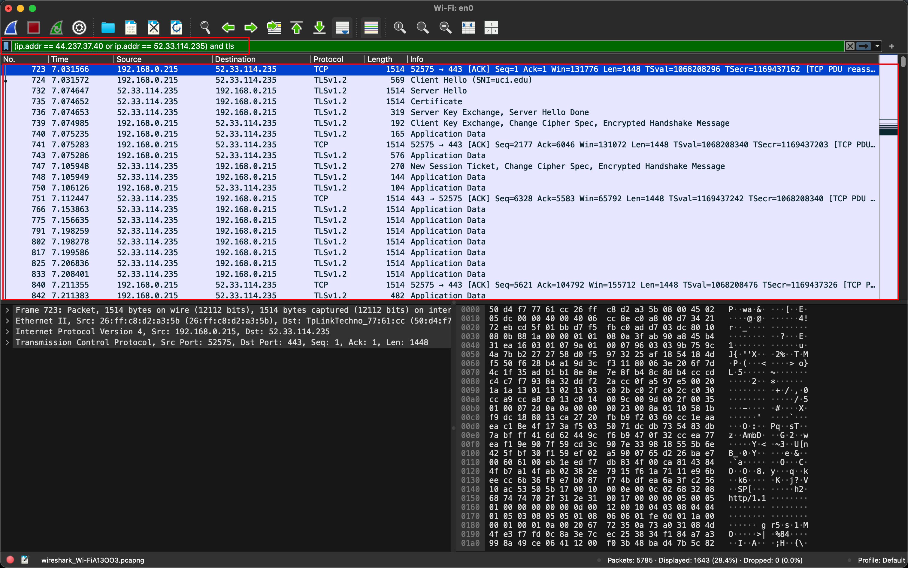
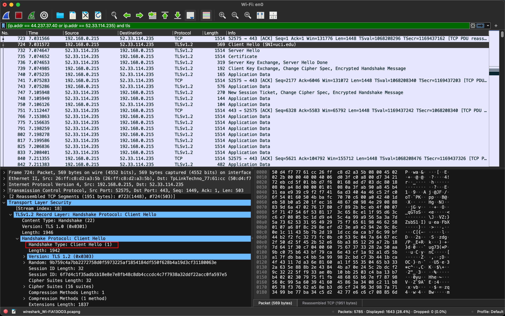
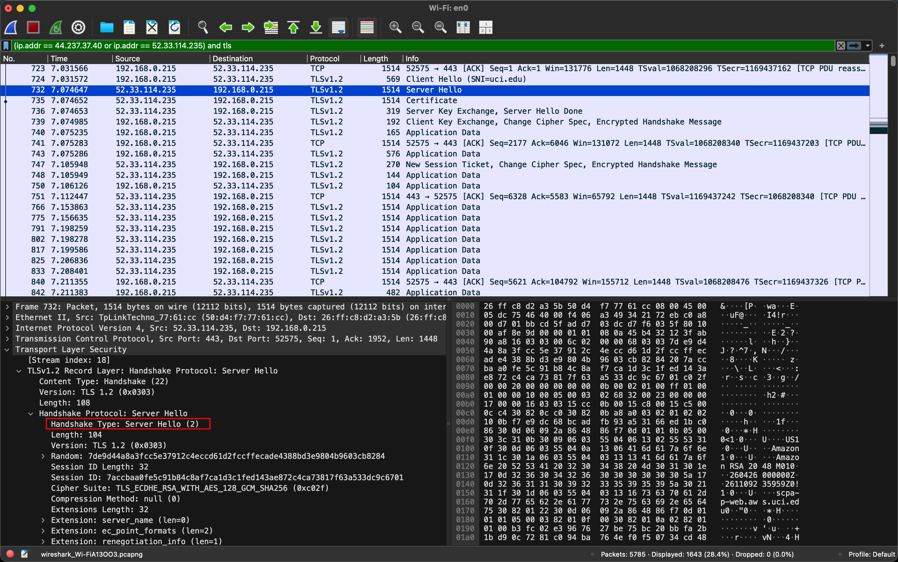

# Packet Sniffing Report - Zhenyu Song

## Overview

Used Wireshark on macOS to capture network traffic while loading
`https://uci.edu` in Chrome, then filtered out the HTTPS (TLS over TCP/443)
packets exchanged between my machine and the UCI web server.

## IP Addresses

```shell
~/Courses/SWE267P (main*) » ipconfig getifaddr en0                                                                                                                                         ericsong@dhcp-10-8-066-049
192.168.0.215
(base) ---------------------------------------------------------------------------------------------------------------------------------------------------------------------------------------------------------------
~/Courses/SWE267P (main*) » nslookup uci.edu                                                                                                                                               ericsong@dhcp-10-8-066-049
Server:		192.168.0.1
Address:	192.168.0.1#53

Name:	uci.edu
Address: 44.237.37.40
Name:	uci.edu
Address: 52.33.114.235
```

- My machine (`en0`, from `ipconfig getifaddr en0`): `192.168.0.215`
- `uci.edu` (from `nslookup uci.edu`): `44.237.37.40`, `52.33.114.235`
  - The session in the screenshots connected to `52.33.114.235`.

## Capture & Filter

1. Started a live capture on `Wi-Fi: en0` in Wireshark.
2. Loaded `uci.edu` in the browser, then stopped the capture.
3. Applied display filter:
   ```
   (ip.addr == 44.237.37.40 or ip.addr == 52.33.114.235) and tls
   ```

## Evidence

HTTPS (TLS) packets between my machine (`192.168.0.215`) and `uci.edu`
(`52.33.114.235`) on TCP port 443 — Client Hello, Server Hello,
Certificate, and Application Data are all visible:



Client Hello (with `SNI=uci.edu`) confirms the TLS handshake target:



Server Hello returned by `uci.edu`:


