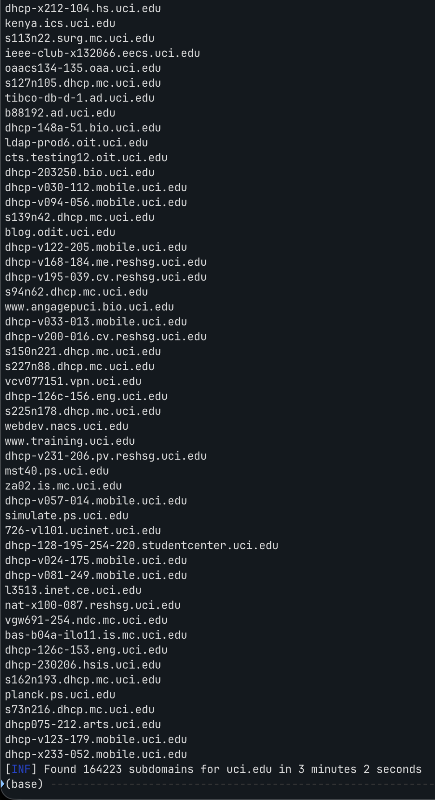
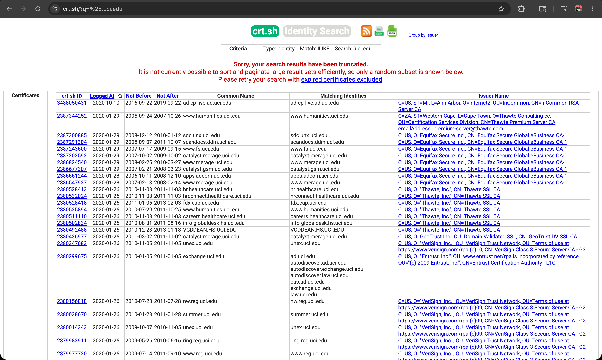
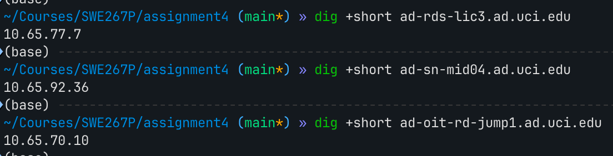
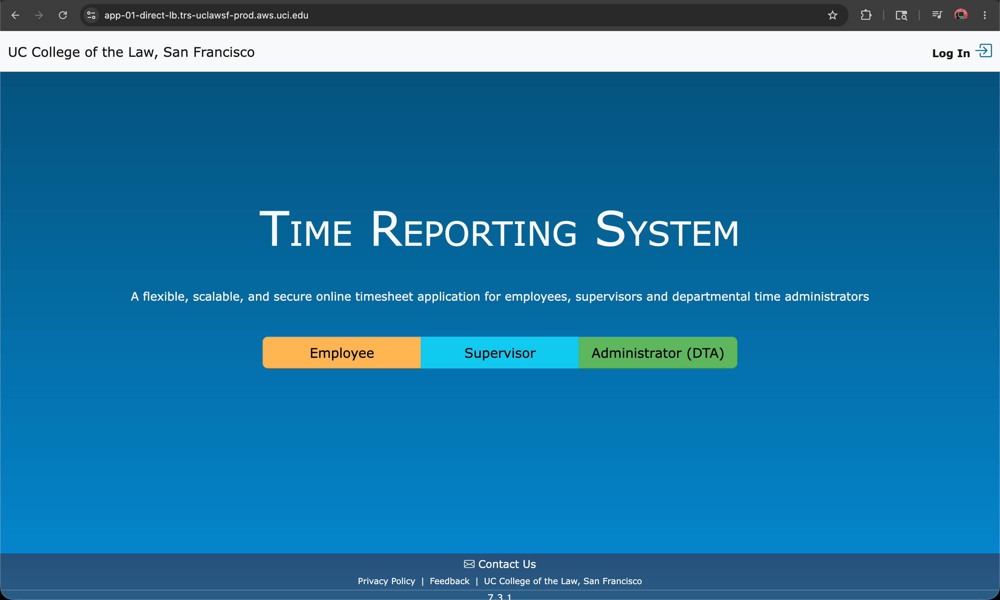
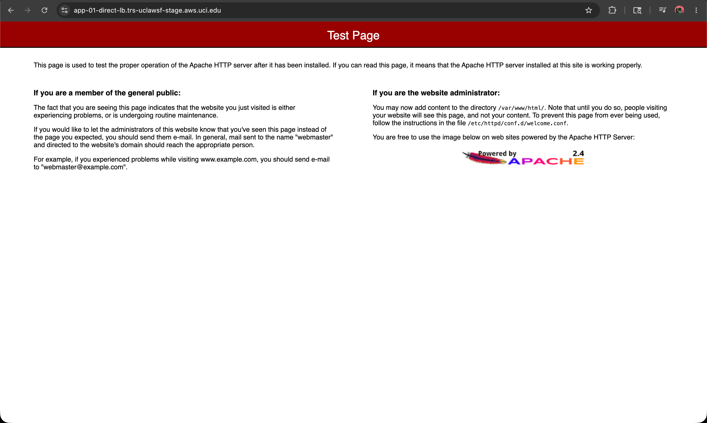
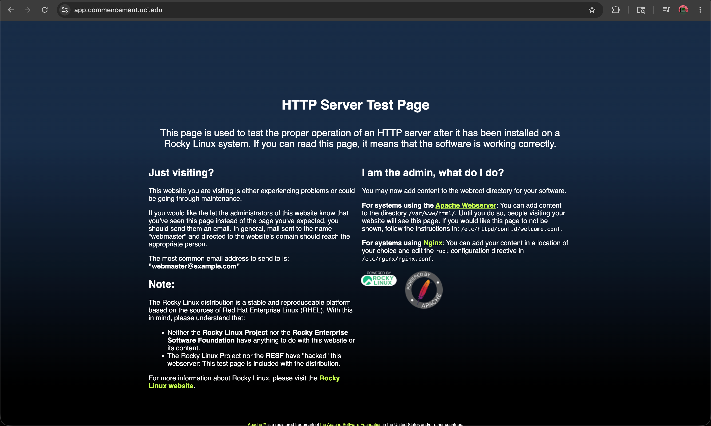
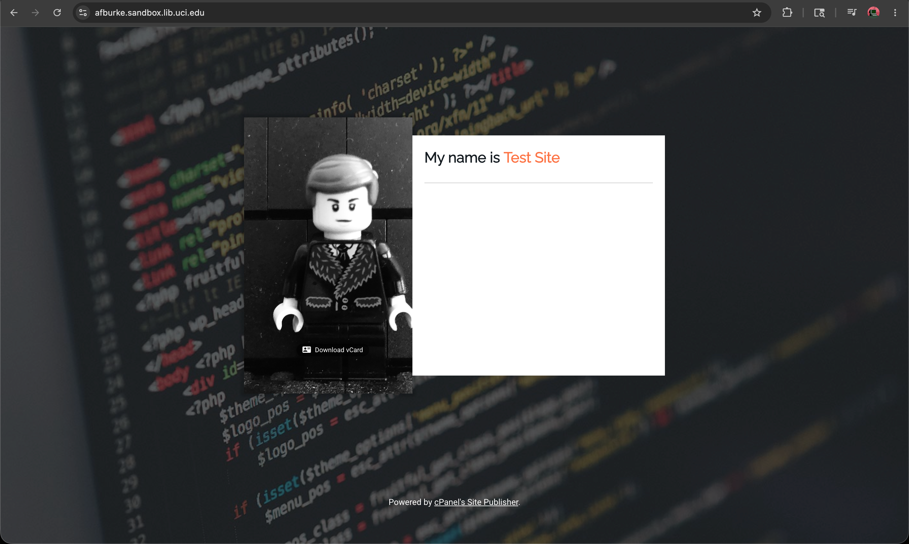
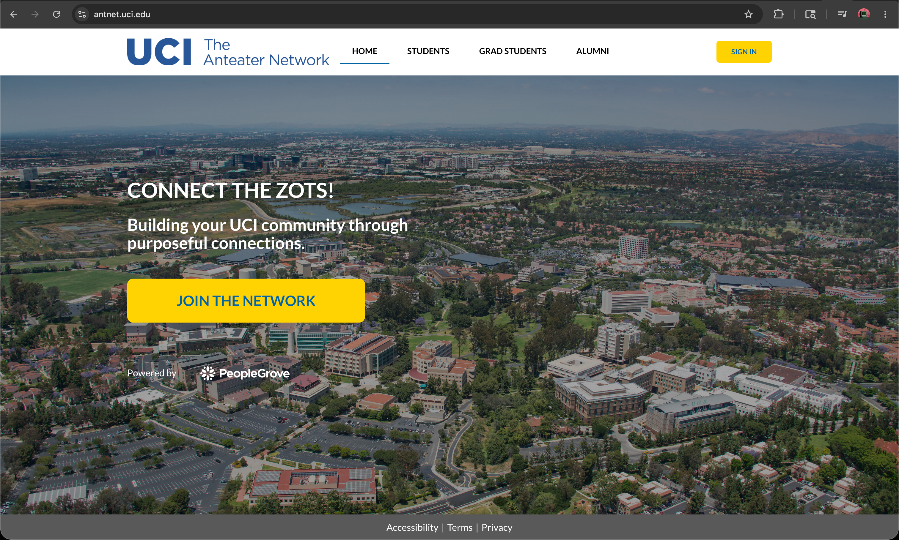

# Cloud Recon Report

**Author:** Zhenyu Song (zhenyus4@uci.edu)
**Date:** 05/20/2026

## Overview

Map UCI's cloud-hosted application assets reachable from the public Internet, starting from `uci.edu` and its subdomains, IPv4 only. Scope: discover → resolve → attribute to cloud provider → probe HTTP → flag risky exposures.

All numbers below come from running the four scripts in `scripts/`. Raw artifacts are in `data/`.

## Methodology

Five iterative steps, each producing input for the next:

1. **Passive subdomain enumeration** — `subfinder -d uci.edu -all` (aggregates ~30 passive sources) plus a direct `crt.sh` Certificate Transparency query for `%.uci.edu`. Merge + dedupe.
2. **Internal-pattern filter** — drop obvious internal hostnames (cameras, VLAN gateways, workstation DHCP names, MAC-address-shaped hosts) by regex before resolving. Cuts query volume by ~46% without losing public-facing services.
3. **DNS resolution** — `dig @1.1.1.1 +short A` per subdomain, parallelized via `xargs -P 200`. IPv4 only.
4. **Cloud attribution** — match each unique IP against published CIDR ranges from AWS / GCP / Oracle / Cloudflare, with UCI's own ARIN-registered prefixes (`128.195/16`, `128.200/16`, `169.234/16`, `160.87/16`) hard-coded as fast paths. IPs not matched fall back to bulk `whois -h whois.cymru.com` ASN lookup; the holder string is keyword-classified (Microsoft→Azure, Salesforce, Akamai, …). RFC1918 IPs get their own bucket.
5. **HTTP probing** — `curl -sk` per cloud-hosted subdomain, https-first then http fallback, capturing status code, `Server:` header, and HTML `<title>`. Run only on cloud-attributed hosts (≈ 2.9K) — on-prem UCI hosts are out of the assignment scope.

**Iteration example in this run.** Resolving `ad-rdpgw-test.ad.uci.edu` from step 3 returns a CNAME chain, not a flat A record:

```
$ dig +short ad-rdpgw-test.ad.uci.edu
rd-gateway-dev.ad.uci.edu.
rd-gw-nlb-test12-ad477743bde42145.elb.us-west-2.amazonaws.com.
54.191.253.111
34.214.82.255
```

The intermediate ELB hostname `rd-gw-nlb-test12-...elb.us-west-2.amazonaws.com` is **not** a `*.uci.edu` cert SAN and neither `subfinder` nor `crt.sh` could surface it on their own — only a DNS follow-up can. From that single chain an attacker learns three things for free: (a) the deployment uses a Network Load Balancer (NLB) rather than ALB, (b) it lives in `us-west-2`, and (c) the artifact suffix `test12` suggests this is the 12th iteration of an internal RDP-gateway test environment. We also tried feeding back TLS-cert SANs (`openssl s_client | x509 -text | grep DNS`): the shared cert on `app.commencement.uci.edu` covers 151 hostnames in one shot, but in this run all 151 were already in `subdomains.txt` because `crt.sh` had indexed the same CT entry — a useful **negative** finding that validates `crt.sh` coverage rather than uncovering new names. The two iteration channels (CNAME chase vs cert-SAN feedback) thus produced different value: one revealed AWS-side topology, the other confirmed enumeration completeness.

## Tools used

| Tool | Purpose | Why chosen | Drawback |
|---|---|---|---|
| `subfinder` | Aggregate passive subdomain sources | Single CLI fronts ~30 APIs, free + fast | Pulls a lot of internal/DHCP noise — needs filtering |
| `crt.sh` JSON | Certificate Transparency hostnames | Authoritative ("a cert was issued") | Misses internal-only hosts; rate-limits |
| `dig +short` | DNS resolution | Built-in, scriptable | Slow at scale without parallelism |
| `xargs -P` | Parallelism | No new dependencies | Coarse — no per-host backoff |
| AWS/GCP/Oracle/Cloudflare CIDR JSONs | Cloud attribution | Vendor-published, current | Azure has no stable public JSON — covered via ASN fallback |
| Team Cymru `whois.cymru.com` | Bulk ASN lookup | One TCP session resolves all leftover IPs in seconds | Holder strings are free-form — needs keyword classifier |
| `curl` + `<title>` grep | HTTP fingerprint | Trivial, no `httpx`/`nuclei` dependency | No TLS cert inspection, no tech-stack detection beyond `Server:` |

Considered but skipped: `amass` (overkill for assignment scope), `httpx` / `nuclei` (active vuln scanning is out of scope), DNS bruteforce wordlists (passive sources were sufficient).

**Alternatives considered (pros/cons summary):** `amass` vs `subfinder` — `amass` adds active brute-force on top, 10x slower and noisier, marginal coverage gain for a public university domain that's already well-indexed; `subfinder` passive-only was sufficient. Censys / SecurityTrails APIs vs `crt.sh` — paid tiers cover the same CT data plus historical DNS, but `crt.sh` is free, JSON-queryable, and authoritative for "a cert was issued". `dnsx` / `massdns` vs `dig` + `xargs` — order-of-magnitude faster on large input, but external dependency; `dig` finished 89K in 3 min, fast enough. `httpx` / `nuclei` vs `curl` — better fingerprinting + vuln signatures, but `nuclei` actively probes for vulns, which is outside the read-only scope of this assignment.

## Findings

### Enumeration funnel

| Stage | Count |
|---|---:|
| Raw subdomains from `subfinder -all` | 164,237 |
| From `crt.sh` (CT logs) | 2,061 |
| Merged + deduped | 164,619 |
| After internal-pattern filter | 89,375 |
| Resolved to ≥ 1 IPv4 A record (unique subs) | 59,622 |
| Unique IPv4 addresses | 56,264 |

### Cloud provider distribution

By **(subdomain, IP) pairs**, totaling 62,655:

| Provider | Pairs | Notes |
|---|---:|---|
| UCI on-prem (UCnet / UCI Health) | 56,620 | 128.195/16, 128.200/16, 169.234/16, 160.87/16 + ASN-matched |
| AWS | 4,785 | mostly `us-west-2` (Oregon) + `us-east-2` (Ohio); a few in `us-gov-west-1` |
| RFC1918 leaked into public DNS | 282 | 180 unique internal IPs (all `10.65.x.x` — UCI AD subnet) |
| DigitalOcean | 274 | `*.sandbox.lib.uci.edu` (library sandboxes) |
| Azure | 239 | matched via ASN fallback (no published JSON) |
| Other (SaaS / 3rd-party) | 169 | Automattic (WordPress.com), Squarespace, Weebly, SDSC, Cox, Proofpoint, Sucuri, Pantheon, Rackspace |
| Fastly | 126 | CDN edge |
| Cloudflare | 93 | CDN edge |
| GCP | 46 | small footprint |
| Salesforce | 8 | community / CRM |
| Oracle | 7 | small footprint |
| Akamai | 6 | CDN |

Unique **cloud-hosted subdomains** (everything except UCI on-prem / RFC1918): **2,909**.

**AWS region breakdown** (parsed from the AWS IP-ranges JSON, by (subdomain, IP) pairs):

| Region | Pairs |
|---|---:|
| `us-west-2` (Oregon — primary) | 2,682 |
| `us-east-2` (Ohio) | 1,750 |
| `GLOBAL` (S3 / CloudFront / IAM endpoints) | 240 |
| `us-east-1` (N. Virginia) | 64 |
| `us-west-1` (N. California) | 40 |
| `us-gov-west-1` (GovCloud) | 3 |
| (uncategorized, ASN-bucket fallback) | 6 |

The 6 uncategorized rows hit AWS via the Team Cymru ASN lookup but did not match any region prefix in the AWS IP-ranges JSON snapshot — typically newly-assigned blocks not yet in the published file, or rows where the JSON's `region` field was missing. UCI is heavily centered on `us-west-2` with `us-east-2` as a secondary, suggesting an active-passive or geo-distributed setup. The `us-gov-west-1` slice is small but covered separately in the risk section.

### Attack surface summary

UCI's public-Internet **cloud attack surface** breaks down as ≈ 2,909 unique cloud-hosted subdomains across at least 11 distinct providers, dominated by AWS (~75% of cloud subdomains) with a meaningful long tail (Azure, GCP, Cloudflare, Fastly, DigitalOcean, Oracle, Akamai, Salesforce, plus ~10 SaaS tenancies). On top of that, ~180 RFC1918 records leak internal infrastructure names into public DNS, and the AWS footprint spans multiple regions including `us-gov-west-1` (GovCloud). The detailed risky exposures are enumerated in the next section.





### HTTP probe summary

Of the 2,909 unique cloud-hosted subdomains, **2,354** responded to an HTTP or HTTPS request (others timed out, refused, or had no listening service):

| Status class | Count | % of responders |
|---|---:|---:|
| 2xx OK | 1,169 | 49.7 % |
| 3xx redirect (mostly to SSO / login) | 798 | 33.9 % |
| 4xx / 5xx | 387 | 16.4 % |

Top `Server:` headers seen:

| Server | Count |
|---|---:|
| openresty | 733 |
| Apache (generic) | 627 |
| Apache/2.4.62 (Rocky Linux) OpenSSL/3.5.1 | 166 |
| nginx | 144 |
| Microsoft-IIS/10.0 | 111 |
| awselb/2.0 | 77 |
| cloudflare | 75 |
| Apache/2.4.58 (IUS) OpenSSL/1.0.2k-fips PHP/7.4.33 | 42 |
| AmazonS3 | 42 |
| Microsoft-HTTPAPI/2.0 | 38 |
| cPanel | 19 |

Worth noting: an Apache build advertising `PHP/7.4.33` shows up 42 times — PHP 7.4 has been end-of-life since November 2022, so any application still running on it should have a migration plan.

**Detected applications.** Server-header counts alone overcount stacks like ASP.NET (an `IIS` server can host static files or any backend), so for the IIS subset I ran a follow-up HEAD probe (`curl -skI`) capturing `X-Powered-By` and `X-AspNet-Version` to confirm the application layer:

| Application | Count | Detection signal |
|---|---:|---|
| ASP.NET (IIS-backed) | 92 | `X-Powered-By: ASP.NET` confirmed via follow-up HEAD probe; 34 are `autodiscover.*` Exchange→O365 redirectors, the remaining 58 are first-party UCI apps |
| WordPress | 38 | `<title>` patterns + `wp-` paths in redirects |
| cPanel (Site Publisher) | 38 | `Server: cPanel` or "Powered by cPanel" in body |
| Tomcat (behind Apache + mod_jk) | 22 | `Server: Apache/... mod_jk/...` |

## Surprising / risky exposures

Each finding is tagged with a severity reflecting blast radius × exploitability for an external attacker: **High** = direct path to UCI data or services; **Medium** = enables follow-on attacks or reflects systemic hygiene gaps; **Low** = informational / context-setting.

### 1. RFC1918 internal IPs leaked into public DNS  `[Medium]`

180 unique `10.65.x.x` addresses are returned by public DNS for names like `ad-rds-lic3.ad.uci.edu`, `ad-sn-mid04.ad.uci.edu`, `ad-oit-rd-jump1.ad.uci.edu`, `adm-d-web01.oars.uci.edu`. The IPs themselves aren't routable from the Internet, but the records disclose internal Active Directory infrastructure (license servers, RDP gateways, ServiceNow MID servers, dev databases) — useful intel for any attacker who has already gotten a foothold on campus and wants to pivot. Classic split-horizon DNS that isn't actually split.

```bash
$ awk -F, '$3=="RFC1918 (leaked)"' data/cloud_hosts.csv | head -3
ad-adrap.ad.uci.edu,10.65.88.5,RFC1918 (leaked),...
ad-rds-lic3.ad.uci.edu,10.65.77.7,RFC1918 (leaked),...
ad-sn-mid04.ad.uci.edu,10.65.92.36,RFC1918 (leaked),...
```



### 2. UCI hosts Time Reporting System (TRS) for UCB, UC Merced, UC Law SF on its AWS account  `[High]`

`*.aws.uci.edu` reveals multi-environment, multi-campus deployments:

```
trs-ucb-{dev,stage,prod}.aws.uci.edu       — UC Berkeley TRS
trs-ucm-{stage,prod}.aws.uci.edu           — UC Merced TRS
trs-uclawsf-{stage,prod}.aws.uci.edu       — UC Law San Francisco TRS
```

The `*-prod` hosts respond `200 OK` with title `Index - UC <Campus> Time Reporting System - TRS`. The matching `*-stage` and `*-dev` load balancers respond `403` with the default `Test Page for the Apache HTTP Server` or `It works! Apache httpd` — i.e., the LB is reachable but no app is bound, which both leaks the existence of the environment and suggests the deployment is incomplete. Notable because (a) the naming standard publishes the entire dev/stage/prod topology and (b) UCI is a single tenant for at least three other UC campuses' payroll-adjacent workflows, which is a cross-campus blast radius worth knowing about.




### 3. Default web-server pages on real `*.uci.edu` hosts  `[Medium]`

Beyond TRS, ~30+ hosts return Apache or nginx default pages, e.g.:

- `apps.athletics.uci.edu` (prod) — Apache test page
- `prod.apps.athletics.uci.edu`, `prod.students.athletics.uci.edu`, `prod.data.athletics.uci.edu` — Apache test page
- `kualidocs.oit.uci.edu` — Apache test page
- `app.commencement.uci.edu` — Rocky Linux test page
- `bw.hs.uci.edu` — nginx "This is the default server vhost"

These hosts are bound in DNS, certificate-issued, and live, but the back-end is either offline or misconfigured. From an attacker's view this is interesting because the host is "warm" and could host shadow content; from an operator's view it suggests stale deployments and DNS records that outlived the application.



### 4. `*.sandbox.lib.uci.edu` — personal sandboxes on DigitalOcean  `[Medium]`

274 `*.sandbox.lib.uci.edu` records point at DigitalOcean droplets, named after individuals (`afburke`, `alice`, `dailycey`, `fenai`, `kehan`, …). Three patterns are visible in the probe data: live "UCI Libraries Digital Sandbox Service" Apache, plain `Test Site` Apache (default install never configured), and `autodiscover.<user>.sandbox.lib.uci.edu` MX-style records that return Microsoft Outlook autodiscover 302s. Patching, MFA, and lifecycle of these droplets are almost certainly inconsistent across users, and DNS records persist after droplet teardown unless explicitly cleaned up.



### 5. GovCloud presence (`us-gov-west-1`)  `[Low]`

`engage.police.uci.edu` resolves to three AWS GovCloud IPs (`3.30.76.196`, `3.31.3.176`, `52.222.14.14`). GovCloud is the AWS region tier reserved for CJIS / FedRAMP-class data — consistent with this being the UC Irvine Police Department's external engagement portal, which would handle reporting / records workflows subject to law-enforcement data rules. Worth flagging not because it's "exposed" but because it implies a high-sensitivity workload whose audit scope (CJIS, possibly FedRAMP-Moderate) should be checked explicitly; any future expansion into GovCloud should pass through the same governance.

### 6. Long-tail SaaS surface  `[Medium]`

`*.uci.edu` DNS resolves into Salesforce, Squarespace, Weebly, Automattic (wordpress.com), Pantheon, Rackspace, Sucuri, and even an SDSC ASN. Each is a separate tenancy that someone in UCI provisioned and presumably owns; the central security team likely has no inventory of all of them.

```
antnet.uci.edu                  → PeopleGrove (career-services SaaS)
*.healthcare.uci.edu (some)     → cloudflare
research.test-pantheon.bio.uci.edu → Pantheon (staging — name says so)
```



## Recommendations

Tagged by priority: **[P1]** **[P2]** **[P3]**

1. **[P1] Decouple internal DNS from public DNS.** Stop publishing `*.ad.uci.edu`-style records that resolve to RFC1918 addresses. At minimum move these into a split-horizon view that doesn't answer to public resolvers.
2. **[P1] Sweep for default web-server pages.** A trivial weekly probe that flags titles like "Test Page for the Apache HTTP Server", "It works!", or "Welcome to nginx" on any `*.uci.edu` host would surface stale / broken deployments before someone else does.
3. **[P2] Adopt a naming standard that does not disclose environment.** Avoid `*-dev`, `*-stage`, `*-prod` in public DNS. If dev/stage must be reachable, gate them behind SSO + IP allowlists rather than just relying on an attacker not knowing the hostname.
4. **[P2] Catalogue and govern SaaS tenancies.** Require central registration for any `*.uci.edu` CNAME pointing at a third-party SaaS. Pair every external tenancy with a UCI owner of record and a renewal review.
5. **[P2] Lifecycle library/researcher sandboxes.** For `*.sandbox.lib.uci.edu` and similar personal-droplet patterns, define a 90/180-day expiry, require MFA + a patching baseline, and auto-clean DNS records on droplet teardown.
6. **[P3] Build a continuous external asset inventory.** Re-run a pipeline like the one in `scripts/` weekly. Diff the cloud-attribution result to flag new third-party SaaS tenancies and new cloud accounts.
7. **[P3] Subscribe to Certificate Transparency for `uci.edu`.** Newly-issued certs (= newly-deployed services) should trigger an alert to the central security team. crt.sh and `cert-monitor`-style tools make this cheap.

## Challenges & lessons

The biggest practical issue was scale: `subfinder` returned ~165K hostnames, the majority of which are individual workstations, cameras, and VLAN gateways scraped from PTR-record sources. Without the pattern filter and a high-parallelism resolver the resolution step would have taken close to an hour. The simplest mitigation was a small set of regex exclusions plus `xargs -P 200` against a public resolver (`1.1.1.1`); end-to-end resolution then took under three minutes.

Cloud attribution was a different shape of problem: AWS, GCP, Oracle, and Cloudflare publish stable IP-range JSONs, but Microsoft Azure does not (the link is behind a JS-gated click-through). The cheap and reliable workaround was to fall back to Team Cymru's bulk WHOIS server for any IP not matched by a published range, then keyword-classify the holder string. That covered Azure, on-campus prefixes the published ranges miss, and every SaaS provider as a bonus.

The other notable surprise was how much can be inferred from naming alone — several of the findings above (RFC1918 leaks, dev/stage topology, multi-campus TRS) require no probing at all, only DNS reads. That argues for treating DNS hygiene as a security control, not just a networking concern.

## Appendix — reproducing this report

```bash
cd assignment4
bash    scripts/01_enum.sh uci.edu                           # → data/subdomains*.txt
bash    scripts/02_resolve.sh data/subdomains_filtered.txt   # → data/resolved.csv
python3 scripts/03_cloud_attr.py data/resolved.csv           # → data/cloud_hosts.csv
# Filter to cloud-attributed only:
awk -F, 'NR==1 || ($3!="UCI on-prem" && $3!="UCI on-prem / UCnet" && $3!="RFC1918 (leaked)")' \
    data/cloud_hosts.csv > data/cloud_hosts_external.csv
bash    scripts/04_probe.sh data/cloud_hosts_external.csv    # → data/probe.csv
```

Spot-checks:

```bash
# Confirm one AWS attribution
awk -F, '$3=="AWS"{print $2; exit}' data/cloud_hosts.csv | xargs whois | grep -i amazon

# Confirm one RFC1918 leak
dig +short ad-rds-lic3.ad.uci.edu

# Show all default Apache test pages found
awk -F, 'NR>1 && $4~/[Tt]est Page for the Apache|[Ii]t [Ww]orks|default server vhost/' data/probe.csv

# Count TRS multi-campus hosts
awk -F, 'NR>1 && $1~/trs-(ucb|ucm|uclawsf)-/' data/probe.csv | wc -l
```
