# Web Hacking Assignment Report

**Author:** Zhenyu Song (zhenyus4@uci.edu)
**Date:** 06/03/2026
**Environment:** Kali Linux VM
**Target application:** OWASP Juice Shop at `http://127.0.0.1:42000`  

## 1. Web Application Proxy

For this assignment I used **Burp Suite Community Edition** as the web application proxy and **FoxyProxy** as the browser proxy manager. Burp was configured to listen on `127.0.0.1:8080`, and FoxyProxy was configured to send browser traffic to that address when enabled.

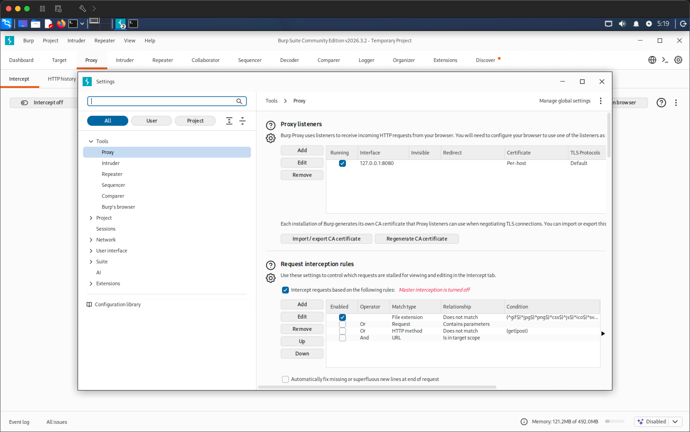

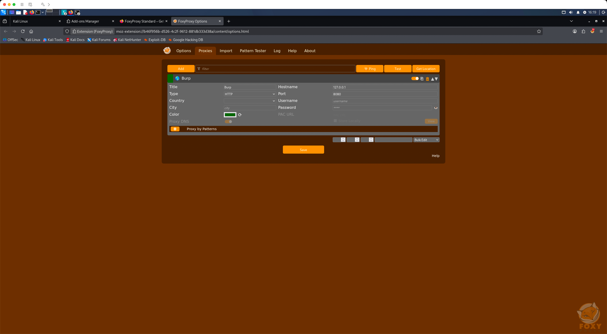

I verified that the proxy was working by enabling FoxyProxy, browsing to the Juice Shop site, and confirming that HTTP requests appeared in Burp Proxy HTTP history. I also tested toggling the proxy off to make sure the browser could return to direct network access.

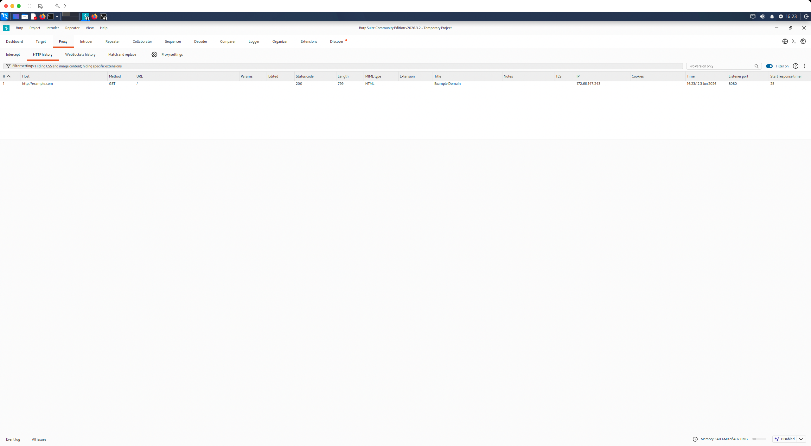

The main proxy setup challenge was getting Firefox to send local Juice Shop traffic to Burp. FoxyProxy was correctly configured for `127.0.0.1:8080`, and Burp successfully captured external test traffic such as `example.com`, but requests to `http://127.0.0.1:42000` did not initially appear in Burp HTTP history. I first tried Burp's built-in browser, but this Kali VM displayed `Burp browser is not available`. I then checked Firefox's proxy settings and found that the visible `No proxy for` field was empty, but Firefox still had the advanced preference `network.proxy.allow_hijacking_localhost` set to `false`. After changing this preference to `true` in `about:config`, Firefox was allowed to proxy local `127.0.0.1` traffic through Burp.

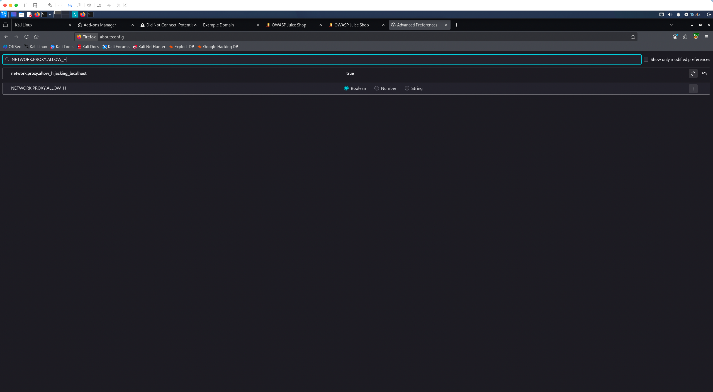

I chose Burp Suite because it is widely used for web application testing, easy to configure for manual request inspection, and already familiar in many security labs.

**Pros:** Burp makes it easy to inspect requests, modify parameters, replay traffic, and understand how the browser communicates with the backend. It also works well with FoxyProxy for quickly switching proxy settings.

**Cons:** The Community Edition has limitations compared with the paid version, especially around automation and scanning. It can also interrupt normal browsing if intercept is left enabled.

## 2. OWASP Juice Shop Installation

I first attempted to install OWASP Juice Shop from the Kali package repository:

```bash
sudo apt update
sudo apt install juice-shop
```

This failed with `Unable to locate package juice-shop`. The Kali VM was using the ARM (`arm64`) package repository, while the Kali Juice Shop package was not available for this architecture in my repository configuration. I documented this as the main installation challenge.

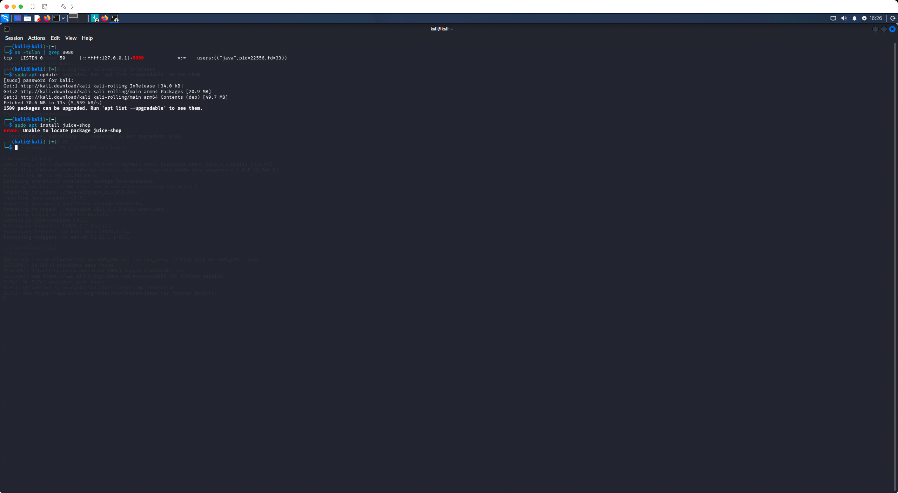

To continue the lab without changing the VM, I installed and ran Juice Shop with **Podman** using the official container image:

```bash
sudo apt install podman
podman run -d --name juice-shop -p 127.0.0.1:42000:3000 docker.io/bkimminich/juice-shop
```

I verified that the container was running with:

```bash
podman ps
```

I also verified that Juice Shop was listening locally on port `42000` with:

```bash
ss -ltnp | grep 42000
```

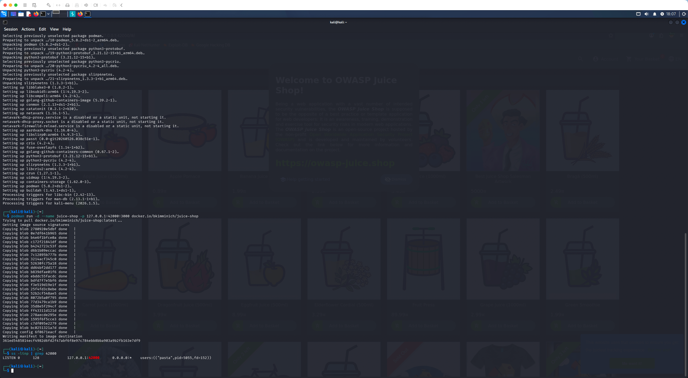

I accessed the application at `http://127.0.0.1:42000`.

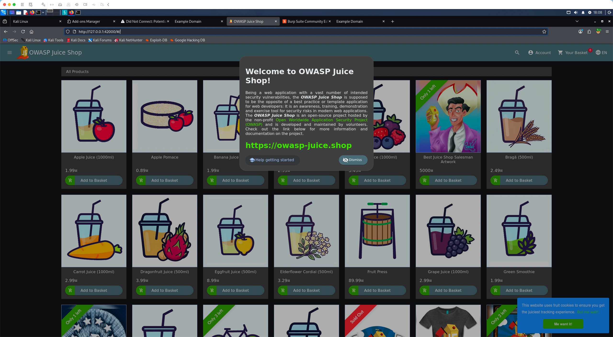

Because I used the container method, Juice Shop was managed from the command line with Podman instead of the Kali helper scripts. I stopped and started it with:

```bash
podman stop juice-shop
podman start juice-shop
```

After stopping it, I verified that port `42000` was no longer listening.

Although my installation used Podman, I also reviewed the official Kali helper commands that would normally be installed under `/usr/bin`. The current Kali package documents `juice-shop-start` and `juice-shop-stop`; the older `juice-shop` command is deprecated. These helper commands manage `juice-shop.service`, whose main process is `npm start`, and the packaged service exposes Juice Shop on TCP port `42000`. My `podman run -d -p 127.0.0.1:42000:3000` setup plus `podman stop/start juice-shop` was functionally equivalent for the lab, but used container isolation instead of running Node directly on the Kali host.

From an attack surface perspective, running Juice Shop exposes a deliberately vulnerable web application on the configured local port. Binding it to `127.0.0.1:42000` kept the service limited to the local VM, which reduced unnecessary network exposure while still allowing browser and proxy testing.

## 3. Juice Shop Tutorials

After starting Juice Shop, I created a test user, logged in, browsed products, added items to the basket, completed a purchase with fictitious payment data, reviewed the order details, and explored areas such as feedback, complaint, and support chat.

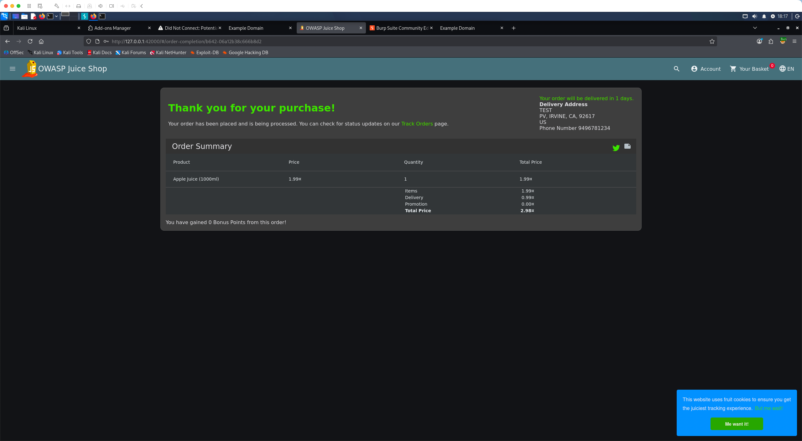

While browsing the site, I inspected traffic with Burp and the browser developer tools. This showed API requests and response data that were not always visible in the page UI, which helped explain how the single-page application communicates with the backend.

I completed the required tutorials from the Score Board:

- Scoreboard
- DOM XSS
- Bonus Payload
- Privacy Policy
- Login Admin
- Password Strength
- View Basket
- Forged Feedback

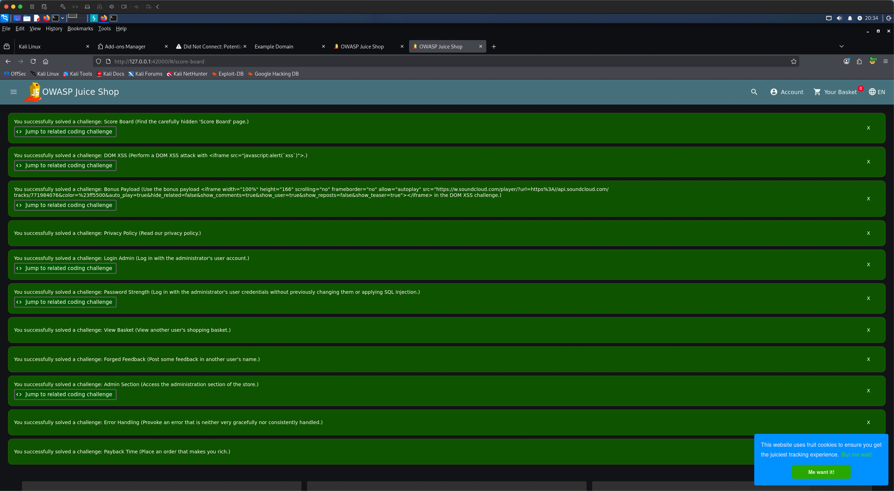

I also tested the progress backup and restore feature. I saved the current challenge state to a file, then restored from that saved file to confirm that challenge progress could be recovered.

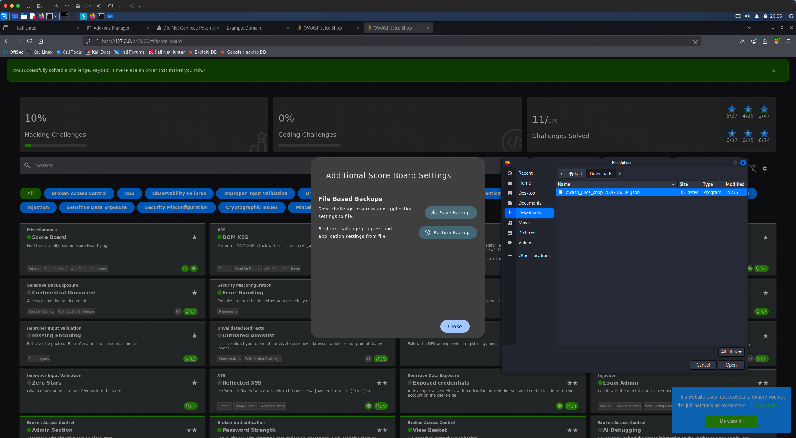

Juice Shop is useful because it combines realistic web application behavior with intentionally vulnerable features and built-in progress tracking. Its Score Board gives clear feedback, and the backup/restore feature makes it easier to retry challenges without losing progress. A limitation is that some challenges are intentionally artificial, so the exact exploit steps may not always match a production application, but the underlying security lessons are still useful.

## 4. Web Hacking Challenges

### 4.1 Scoreboard

**Time spent:** 1 minute
**Hints or external solutions used:** no

My approach was to locate and open the hidden Score Board route, then use it to track solved and unsolved challenges.

What worked: Open `http://127.0.0.1:42000/#/score-board`
What did not work: Browsing only through the normal product UI did not reveal the Score Board link.
Lesson learned: Security testing often starts with discovering application functionality that is not obvious from the main UI.

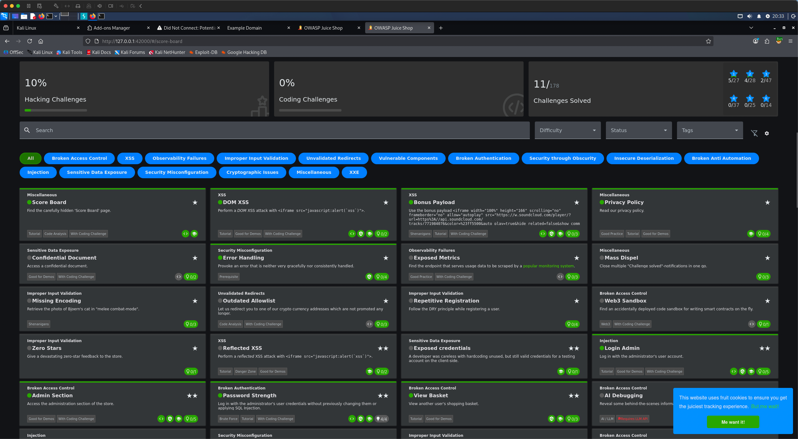

### 4.2 DOM XSS

**Time spent:** 2 minutes
**Hints or external solutions used:** no

My approach was to identify a user-controlled input that was reflected into the page by client-side JavaScript. I used the search function and tested whether input was rendered as text or interpreted as HTML/JavaScript. The successful solution used a DOM-based script injection payload through the search field.

What worked: Enter `<iframe src="javascript:alert(`xss`)">` in search box.
What did not work: Normal search strings such as product names were only treated as search terms and did not execute code.
Lesson learned: DOM XSS can happen entirely in browser-side code, so server-side filtering alone is not enough. Output encoding and safe DOM APIs are important defenses.

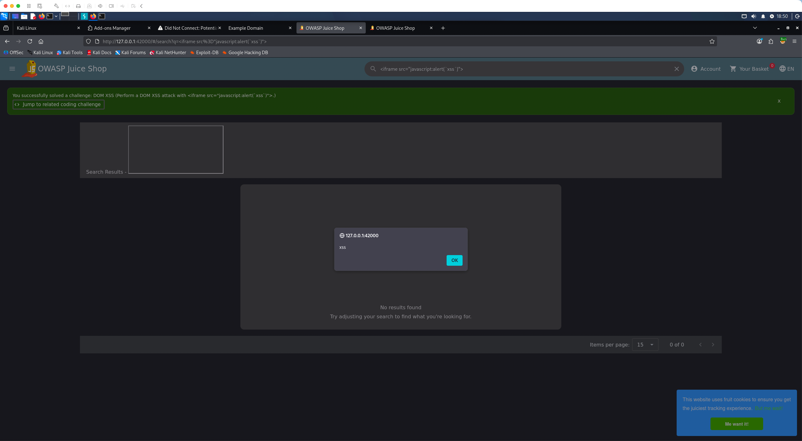

### 4.3 Bonus Payload

**Time spent:** 2 minutes
**Hints or external solutions used:** no

My approach was to follow the tutorial instructions and test a payload variant that Juice Shop recognized as a successful XSS-related solution.

What worked: Enter `<iframe width="100%" height="166" scrolling="no" frameborder="no" allow="autoplay" src="https://w.soundcloud.com/player/?url=https%3A//api.soundcloud.com/tracks/771984076&color=%23ff5500&auto_play=true&hide_related=false&show_comments=true&show_user=true&show_reposts=false&show_teaser=true"></iframe>` in search box.
What did not work: The shorter DOM XSS payload solved DOM XSS but did not satisfy the bonus payload challenge.
Lesson learned: Small payload changes can affect whether injected content executes or is blocked.

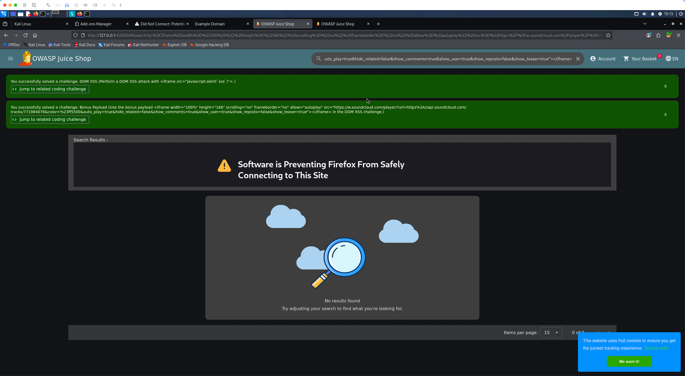

### 4.4 Privacy Policy

**Time spent:** 1 minute
**Hints or external solutions used:** no

My approach was to explore the application UI and routes until I located the privacy policy page required by the challenge.

What worked: Open `Account -> Privacy & Security -> Privacy Policy`.
What did not work: Browsing only the product catalog and basket pages did not expose the privacy policy page.
Lesson learned: Informational pages can still reveal useful route and application structure during reconnaissance.

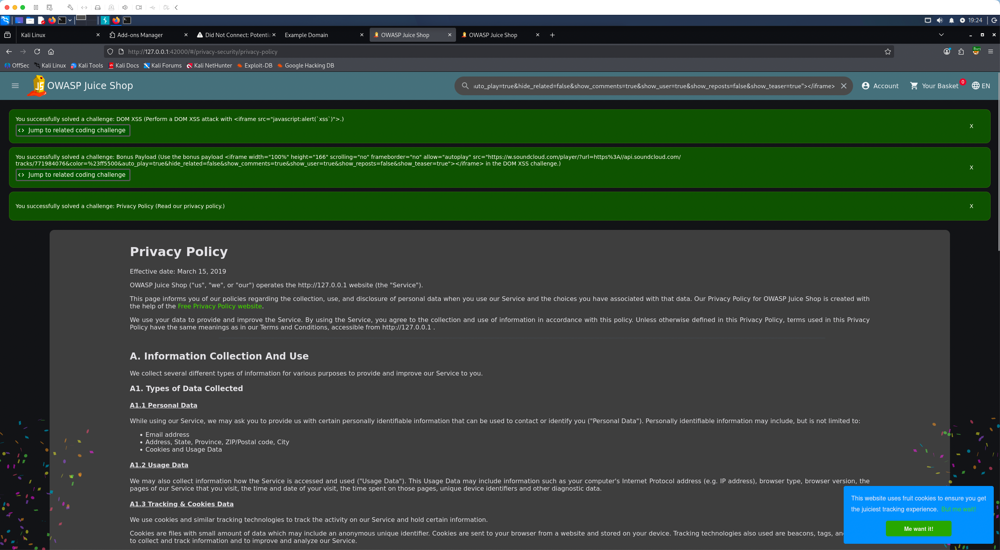

### 4.5 Login Admin

**Time spent:** 5 minutes
**Hints or external solutions used:** no

My approach was to test the login workflow and use the guided challenge to understand how weak authentication logic can be bypassed.

What worked: Enter username: `' or 1=1--`, password `test` in Login page. A SQL injection payload in the email field bypassed login.
What did not work: Normal invalid credentials were rejected.
Lesson learned: Authentication must be enforced server-side with safe input handling and parameterized queries.

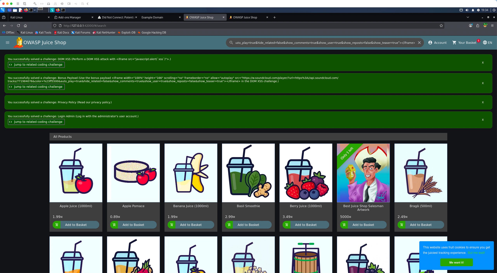

### 4.6 Password Strength

**Time spent:** 5 minutes
**Hints or external solutions used:** [yes to get username and password](https://curiositykillscolby.com/2020/11/15/pwning-owasps-juice-shop-pt-19-password-strength/)

My approach was to test weak password behavior as directed by the tutorial and confirm that Juice Shop accepted the challenge condition.

What worked: Enter username: `admin@juice-sh.op`, password `admin123` in Login page. The known weak admin password allowed login.
What did not work: Random guessed passwords did not work.  
Lesson learned: Password strength requirements reduce account takeover risk but need to be enforced consistently.

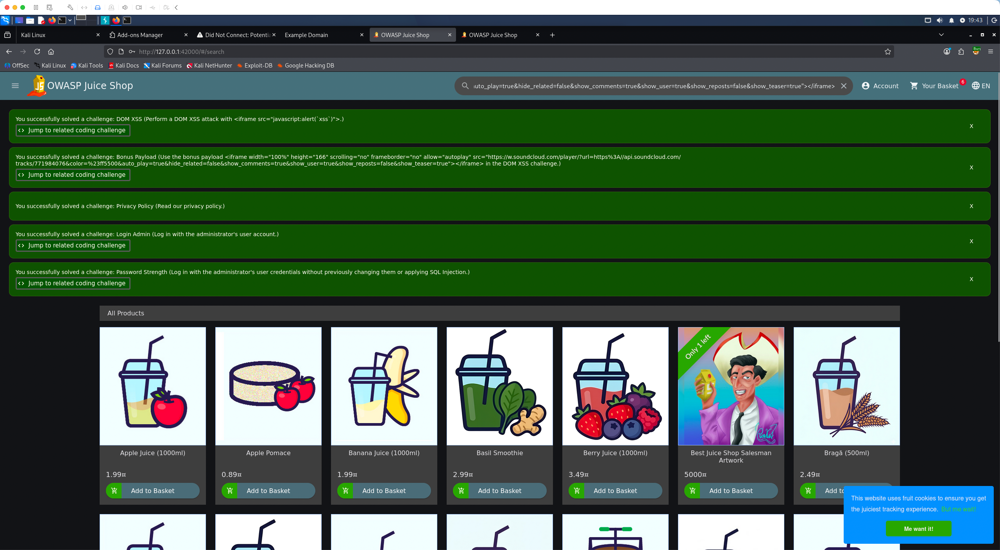

### 4.7 View Basket

**Time spent:** 10 minutes
**Hints or external solutions used:** no

My approach was to inspect basket functionality and understand how basket data is represented in the UI and backend requests.

What worked: Send to server with different basket ID using Burp. Change `GET /rest/basket/6` to `GET /rest/basket/7`, and then send to repeater. Changing the basket id in the basket API request exposed another basket.
What did not work: The normal UI only showed my own basket. 
Lesson learned: User-specific objects need authorization checks, not just hidden links or client-side restrictions.

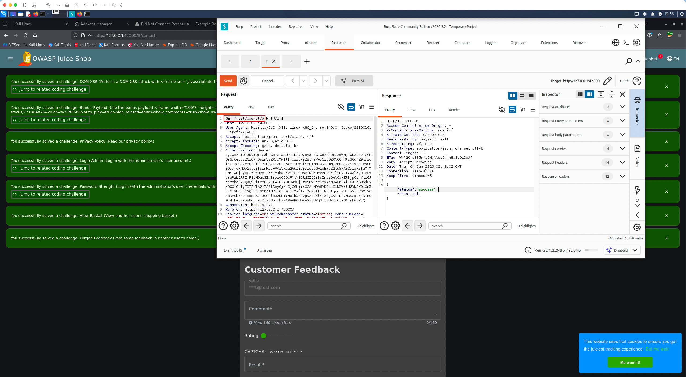

### 4.8 Forged Feedback

**Time spent:** 5 minutes
**Hints or external solutions used:** no

My approach was to submit feedback through the guided workflow and observe how user-controlled metadata could affect the submitted feedback record.

What worked: Send to server with different UserId using Burp. Change the body of `POST /api/Feedbacks` from `"UserId":24` to `"UserId":23`, and then send to repeater. Modifying the feedback UserId submitted feedback as another user.
What did not work: Submitting feedback normally through the UI only used my own user identity.
Lesson learned: User-supplied metadata should be validated and tied to the authenticated session instead of trusted directly.

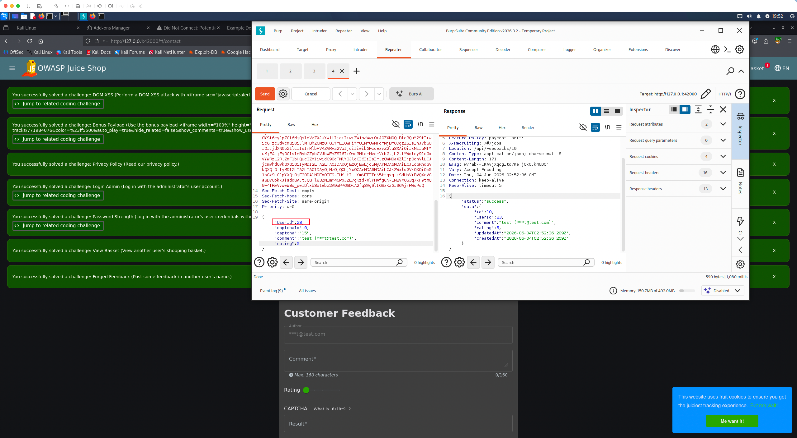

### 4.9 Admin Section

**Time spent:** 2 minutes
**Hints or external solutions used:** no

My approach was to explore application routes and client-side behavior to find hidden functionality. After logging in, I inspected available routes and navigation behavior and accessed the administrative section directly once I identified the route.

What worked: Open `http://127.0.0.1:42000/#/administration` with an admin session (username: `' or 1=1--`, password `test`) solved the challenge.
What did not work: Trying to rely on normal user navigation did not reveal the administration section.
Lesson learned: Hiding admin functionality in the frontend is not an access control mechanism. Sensitive routes must be protected by server-side authorization checks.

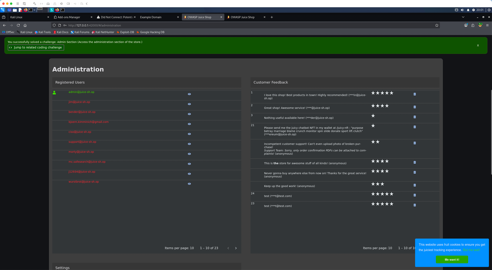

### 4.10 Payback Time

**Time spent:** 30 minutes
**Hints or external solutions used:** no

My approach was to use the proxy to inspect and modify the requests involved in basket and order handling. I looked for numeric fields related to quantity, price, or payment values and tested whether the backend accepted manipulated values.

What worked: Turn on Intercept. Modifying basket item quantity to a negative value in `POST /api/BasketItems` changed order behavior.
What did not work: The normal UI did not allow entering a negative quantity directly. 
Lesson learned: Business logic values must be validated on the server. A client should not be trusted to provide final prices, balances, or payment amounts.

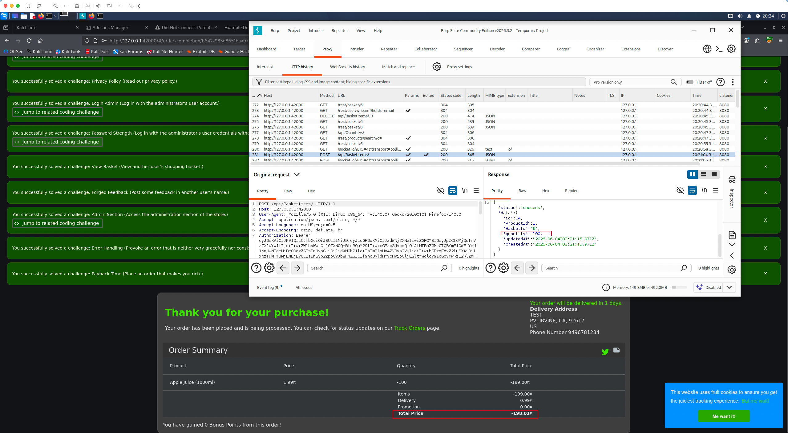

## 5. Lessons Learned

This assignment showed how web proxies, browser developer tools, and vulnerable training applications can be used to understand common web security weaknesses. The most important lesson was that many vulnerabilities come from trusting client-side behavior too much. Hidden routes, browser-side input handling, and editable request fields can all become security issues if the server does not validate authorization, input, and business rules.

The assignment also reinforced the value of documenting the testing process. Recording what worked, what failed, and which hints were used makes the result more useful than simply listing final answers.

## 6. References

- OWASP Juice Shop project: https://owasp.org/www-project-juice-shop/
- Kali Juice Shop package documentation: https://www.kali.org/tools/juice-shop/
- OWASP Juice Shop companion guide: https://pwning.owasp-juice.shop/
- Burp Suite Community Edition: https://portswigger.net/burp/communitydownload
- FoxyProxy: https://getfoxyproxy.org/
- Password Strength hint source: https://curiositykillscolby.com/2020/11/15/pwning-owasps-juice-shop-pt-19-password-strength/
